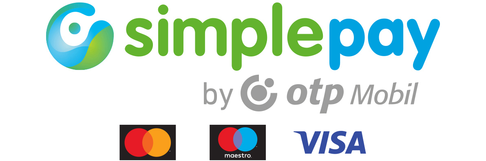

# SimplePay JS SDK

[Magyar README](README.md)

A lightweight utility for integrating Hungary's SimplePay payments in Node.js applications.



Please read the [SimplePay documentation](https://simplepay.hu/fejlesztoknek) for more information.

> 🫵 If this package is useful to you, please star it on GitHub.

## Installation

```bash
# npm
npm install simplepay-js-sdk

# yarn
yarn add simplepay-js-sdk

# pnpm
pnpm add simplepay-js-sdk
```

## Configuration

Set the following environment variables in your `.env` file:

- `SIMPLEPAY_LOGGER` If it set to `true`, it will log varibles - useful only for debugging.
- `SIMPLEPAY_MERCHANT_KEY_HUF` Your Simplepay secret merchant key. Set `SIMPLEPAY_MERCHANT_KEY_HUF_SZEP` for accepting SZÉP kártyás payments. Set `SIMPLEPAY_MERCHANT_KEY_EUR` and `SIMPLEPAY_MERCHANT_KEY_USD` for accepting EUR and USD payments.
- `SIMPLEPAY_MERCHANT_ID_HUF` Your Simplepay merchant id. Set `SIMPLEPAY_MERCHANT_ID_HUF_SZEP` for accepting SZÉP kártyás payments. Set `SIMPLEPAY_MERCHANT_ID_EUR` and `SIMPLEPAY_MERCHANT_ID_USD` for accepting EUR and USD payments.
- `SIMPLEPAY_PRODUCTION` If it set to `true`, it will use production environment, otherwise it will use sandbox environment.
- `SIMPLEPAY_REDIRECT_URL` The URL of your site, where the customer will be redirected after the payment. Can also be provided when starting a payment so you can define different redirect urls for different payments.

## Usage

You should create 3 endpoints, to start the payment, get the payment response and handle the IPN.

### One Time Payment

#### Start Payment Endpoint

```typescript
import { startPayment } from 'simplepay-js-sdk'

try {
  const response = await startPayment({
    orderRef: 'order-12',
    total: 1212,
    currency: 'HUF', // optional, HUF | HUF_SZEP | EUR | USD, defaults to HUF
    customerEmail: 'rrd@webmania.cc',
    language: 'HU', // optional, AR | BG | CS | DE | EN | ES | FR | IT | HR | HU | PL | RO | RU | SK | TR | ZH, defaults to HU
    method: 'CARD', // optional, CARD | WIRE, defaults to CARD
    invoice: {
      name: 'Radharadhya Dasa',
      country: 'HU',
      state: 'Budapest',
      city: 'Budapest',
      zip: '1234',
      address: 'Sehol u. 0',
    },
  }, {
    redirectUrl: 'http://url.to.redirect' // optional, defaults to the value of the SIMPLEPAY_REDIRECT_URL environment variable
  })
  return response
} catch (error) {
  console.error('Payment initiation failed:', error)
  return error
}
```

`response.paymentUrl` will contain the Simplepay payment URL, which you can redirect the customer to.

#### Get Payment Response Endpoint

When the customer returns from the Simplepay payment page, you need to get the payment response at your `SIMPLEPAY_REDIRECT_URL`. The url will contain 2 parameters: `r` and `s`.

```typescript
import { getPaymentResponse } from 'simplepay-js-sdk'

// get "r" and "s" from the url the way you do it on your app and framework

const response = getPaymentResponse(r, s)
```

`response` will have the following properties:

- `responseCode`: `0` on success, or an error code
- `transactionId`: the transaction id
- `event`: the event type: `success` | `fail` | `timeout` | `cancel`
- `merchantId`: the merchant id
- `orderRef`: the order id

#### IPN Endpoint

Simplepay will send a `POST` request to the IPN url and you should send a response back.

**Recommended approach using `handleIpnRequest` function:**

```typescript
import { handleIpnRequest } from 'simplepay-js-sdk'

// In your IPN endpoint handler (e.g., Express, Next.js, etc.)
const ipnBody = await request.text() // Get raw body as string (important: use .text(), not JSON.parse())
const incomingSignature = request.headers.get('Signature')
const { MERCHANT_KEY } = getSimplePayConfig('HUF') // or your currency

const { responseBody, signature } = handleIpnRequest(ipnBody, incomingSignature, MERCHANT_KEY)

// Send response with HTTP 200 status
return new Response(responseBody, {
  status: 200,
  headers: {
    'Content-Type': 'application/json',
    'Signature': signature
  }
})
```

**Manual approach:**

If you prefer to handle it manually:

- check if the signature is valid - use `checkSignature(ipnBody, signatureHeader, SIMPLEPAY_MERCHANT_KEY_HUF)`
- add a `receiveDate` property to the received JSON (ISO 8601 format, e.g., `2025-10-06T07:00:34+02:00`)
- calculate the new signature - use `generateSignature(responseText, SIMPLEPAY_MERCHANT_KEY_HUF)`
- send the `response` with the new `signature` in the HTTP header (not in the JSON body)
- **Important**: The response JSON must be compact (no whitespace). `JSON.stringify()` produces compact JSON by default.


### Recurring Payment

#### Start Recurring Payment Endpoint

Here you have to use the `startRecurringPayment()` function what works the same way as the `startPayment()` function. The only difference is that you have to pass 2 additional properties: `customer` and `recurring`.

```typescript
try {
  const response = await startRecurringPayment({
    // ... other preoperties
    customer: 'Radharadhya Dasa',
    recurring: {
      times: 3, // how many times the payment will be made, number of tokens
      until: '2025-12-31T18:00:00+02:00', // the end date of the recurring payment - use the toISO8601DateString() helper function
      maxAmount: 100000 // the maximum amount of the recurring payment
    }
  })
}
```

The response will have an additional `tokens` property, what will contain the tokens of the registered cards.
You are responsible to save the tokens to your database, so you can use them later to make a payment.


#### Get Recurring Payment Response Endpoint

Use the same enpoint as the one time payment.

#### IPN Endpoint on card registration

It works the same as the `IPN` endpoint of the one time payment.
The response will have the same properties, and 2 additional properties:

 - `cardMask`: xxxx-xxxx-xxxx-1234 - the masked card number what is registered
 - `expiry`: 2025-01-31T00:00:00+02:00 - the expiry date of the registered card

 #### Token Payment Endpoint

 After a card is registered you can use the tokens to make a payment without any user intercation for example by a daily `cron`

```typescript
import { startTokenPayment } from 'simplepay-js-sdk'

// TODO: get payment data from your database, where you saved the tokens

const payment = {
  token: '1234567890123456',
  total: 1212,
  currency: 'HUF' as Currency,
  customer: 'Radharadhya Dasa',
  customerEmail: 'rrd@webmania.cc',
  invoice: {
    name: 'Radharadhya Dasa',
    country: 'HU',
    state: 'Budapest',
    city: 'Budapest',
    zip: '1234',
    address: 'Sehol u. 0',
  },
}

try {
  const response = await startTokenPayment({
    orderRef: Date.now().toString(),
    language: 'HU',
    method: 'CARD', // must be CARD
    ...payment,
  })
  return response
} catch (error) {
  console.error('Token payment initiation failed:', error)
  return error
}
```

#### Card Cancelation

Paying customers should be able to delete their registered card on the website.
To do this, use the `cancelCard` function. Use SimplePay transaction id of the card registration transaction as `cardId`.

```typescript
import { cancelCard } from 'simplepay-js-sdk'

try {
  const response = await cancelCard(cardId)
  
  if (response.status == 'DISABLED') {
    // The card has been successfully deleted
    // TODO: delete the unused tokens and the card from the database
  }
  return response
} catch (error) {
  console.error('Card deletion failed:', error)
  return error
}
```

## License

MIT
